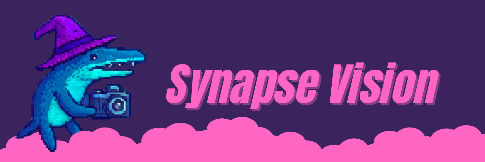

# Home

<figure><figcaption></figcaption></figure>

Synapse is a vision processing library and toolset for FRC[^1] designed to enable easy extensibility and pipeline development with a style similar to robot code.

<table data-view="cards"><thead><tr><th></th><th></th><th data-hidden data-card-cover data-type="files"></th></tr></thead><tbody><tr><td> <strong>Extendability</strong></td><td>Write custom pipelines and vision processing code, in addition to the prewritten pipelines</td><td><a href=".gitbook/assets/settings.png">settings.png</a></td></tr><tr><td><strong>Iterating</strong></td><td>Fast iteration and deployment time with a Robot-Code deployment system</td><td><a href=".gitbook/assets/rush.png">rush.png</a></td></tr><tr><td><strong>UI Integration</strong></td><td>All code pipelines automatically are tunable and work via the UI, without modifying the UI code itself</td><td><a href=".gitbook/assets/ux-design.png">ux-design.png</a></td></tr></tbody></table>


Synapse refers to the complex process by which the brain's visual system utilizes synapses, the connections between neurons, to analyze and interpret visual information. This processing begins in the retina, with the first synapses forming between photoreceptors and downstream neurons, and extends to higher brain areas like the occipital lobe, the brain's visual processing center.  (Wikipedia)


## Source Code

The source code for the entirety of Synapse is available on [GitHub](https://github.com/DanPeled/Synapse)

## Contact Us

To report a bug or submit a feature request for Synapse, please [submit an issue on the Synapse GitHub](https://github.com/DanPeled/Synapse) or contact the developers on [Discord](https://discord.gg/zHJRV8Stj3)

[^1]: FIRST Robotics Competition
