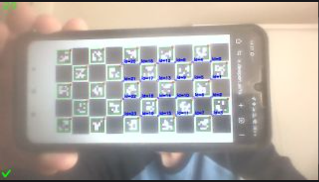

# Camera Calibration


If you want to detect AprilTags, calibrating your camera is essential—_especially_ at the resolution you plan to use. Without proper calibration, tracking accuracy will suffer.


_Even if you're not using AprilTag detection, camera calibration can be used for any other positional data estimation (e.g for object detection)_

## Print The Calibration Board

You can download the calibration target from the [Calib.io](https://calib.io/pages/camera-calibration-pattern-generator) site or directly from the **Cameras** tab on your coprocessor (coming soon).

Use the following settings for the **Charuco** board:

* **Board Type:** Charuco
* **Tag Family:** 5x5
* **Checker Width:** 15 mm
* **Board Size:** 8x11 (Rows x Columns)

## Prepare The Calibration Board

* **Measure everything carefully:**\
  Use calipers to confirm the size of the squares and markers. Precision here really matters.
* **Keep it flat:**\
  Make sure the board is perfectly flat—no bends or wrinkles. Any distortion can throw off your calibration.

## Calibrate Your Camera


When calibrating, the check mark appears on the camera view once the runtime detects enough tags to capture an image. To ensure the best results, only take pictures when this check mark is visible.

<h4 align="center"></h4>


* **Take lots of photos:**\
  Aim for _at least_ 50 good shots for reliable calibration. You can get by with 12, but the results may not be great.
* **Tips:**
  * Move the **board**, not the camera.
  * Capture shots from a variety of angles—up to about 45°.
  * Get a few close-ups.
  * Try to cover the camera’s entire field of view.
  * Avoid taking photos with the board perfectly straight-on.

## External Calibration

Calibration can also be handled offline without the coprocessor if you still have access to the camera.

External sites such as [Calib.db](https://calibdb.net/) can be used in order to calibrate outside of the Synapse runtime.


This is not supported currently by the UI but the data from the calibration can be written manually into the config file of the project

