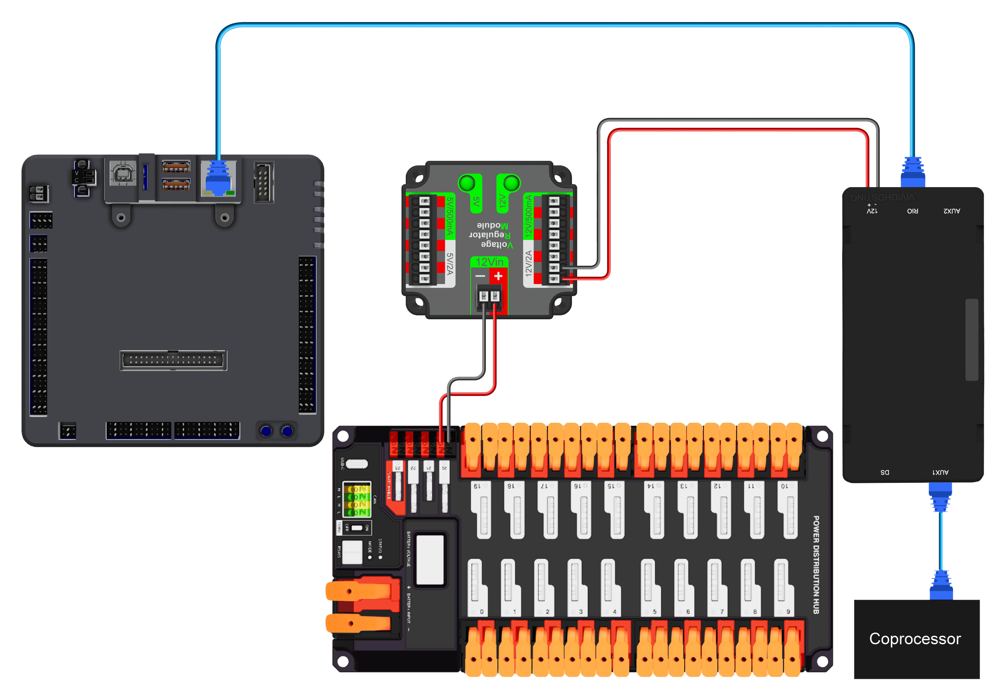
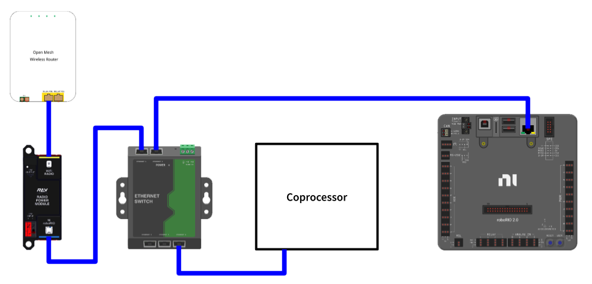

# Networking

## Physical Connection


When using a Synapse coprocessor off robot, you _should_ plug the coprocessor into a physical router/radio. You can then connect your laptop/device used to view the webdashboard to the same network. Some devices may support a "gadget mode" that allows sharing internet via a USB connection, but this isn't promised.&#x20;





Ensure that the radio’s DIP switches 1 and 2 are turned off; otherwise, the radio PoE feature may electrically destroy your coprocessor. [More info.](https://frc-radio.vivid-hosting.net/overview/wiring-your-radio#power-over-ethernet-poe-for-downstream-devices)


<figure><figcaption></figcaption></figure>



We _STRONGLY_ recommends the usage of a network switch on your robot. This is because the second radio port on the old FRC radios is known to be buggy and cause frequent connection issues that are detrimental during competition.

<figure><figcaption></figcaption></figure>




In order to configure robot communication and network identity for the coprocessor, read [#network-settings](../../usage/built-in-pipelines/settings-page.md#network-settings "mention")


## Camera Stream Ports

All of the camera stream ports start at port `1180` and go up from there, and the HTTP address for them would be https://`<deviceip>:118X/?action=stream`
