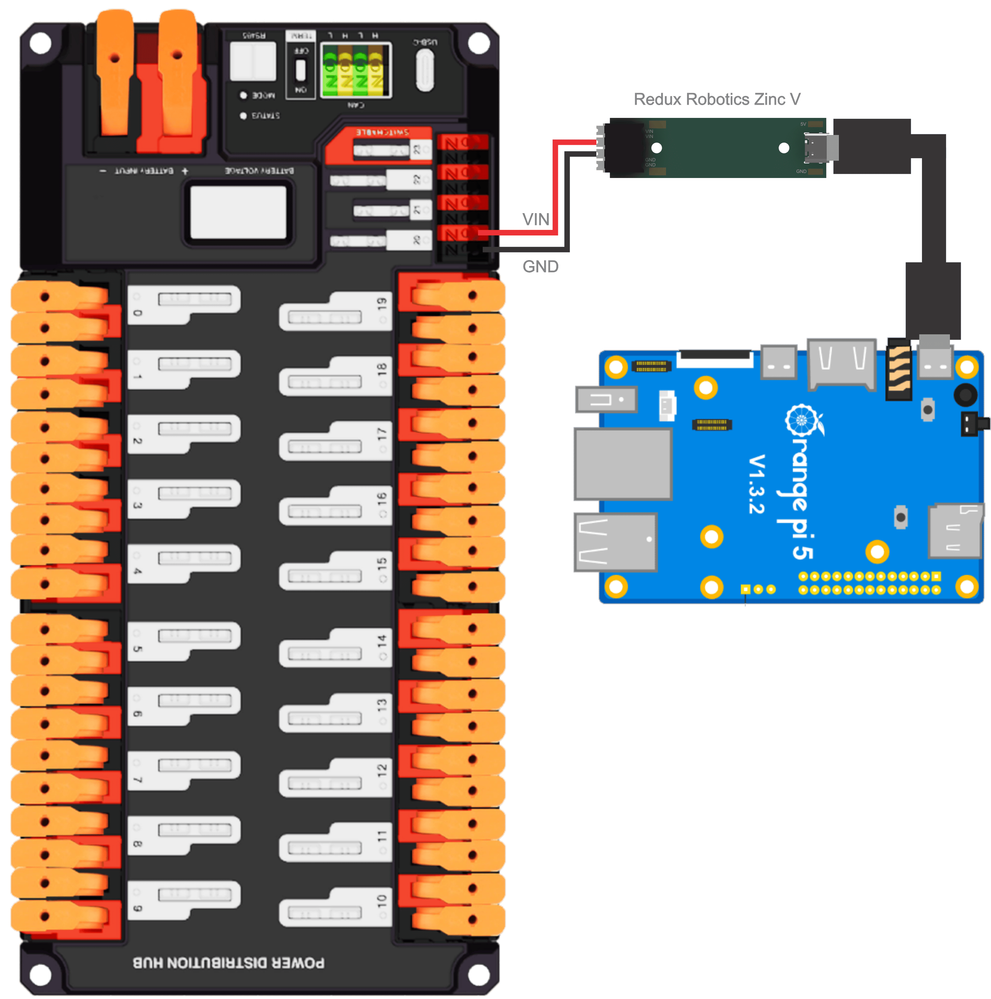
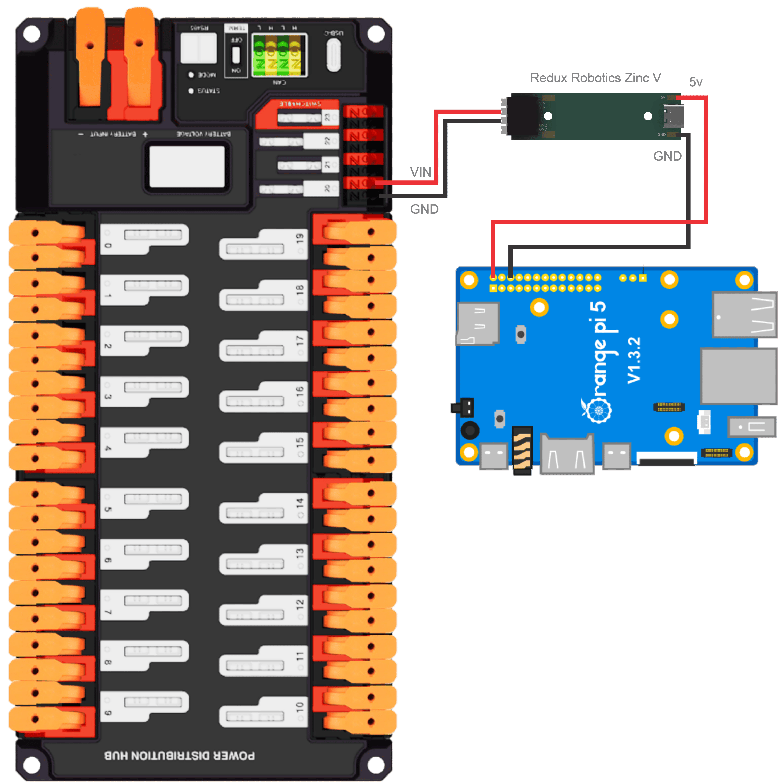
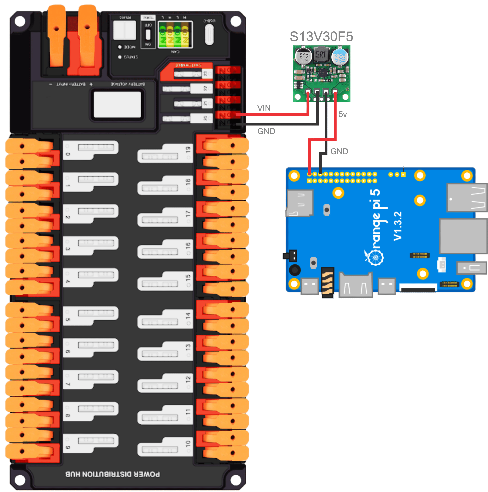
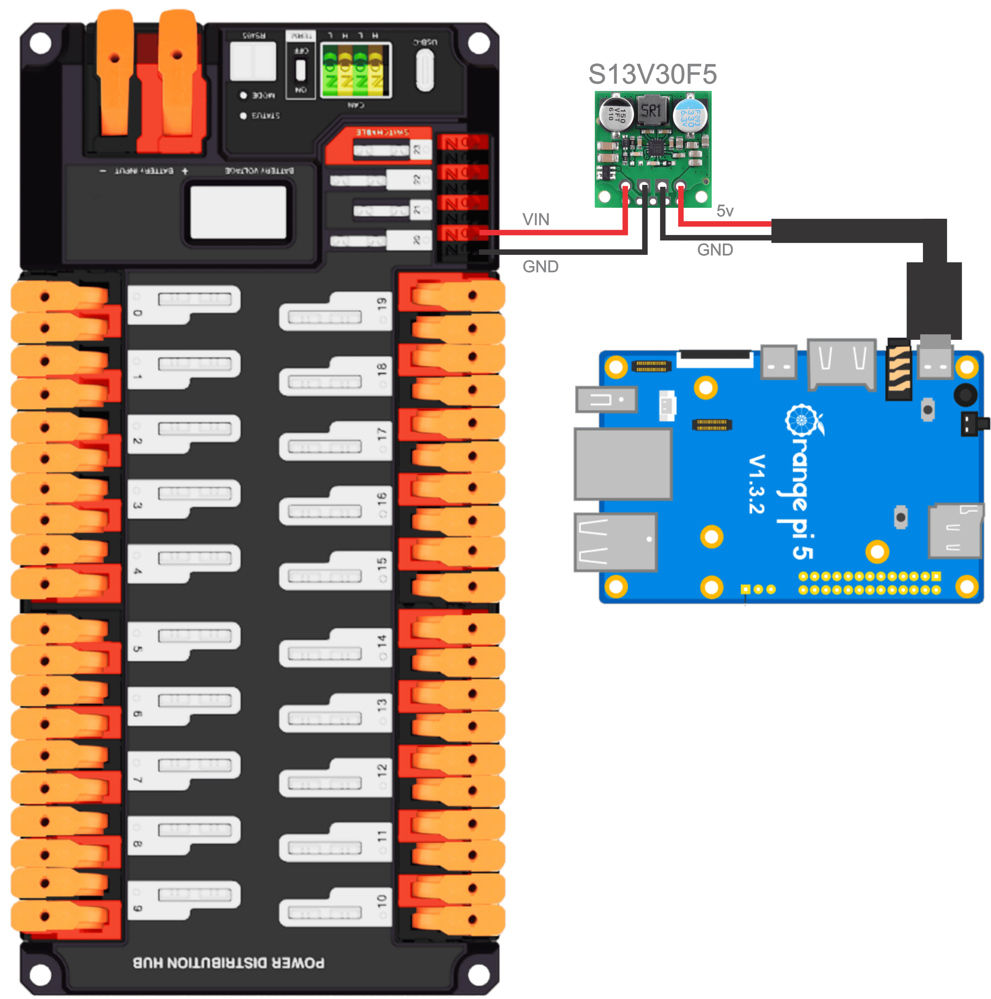
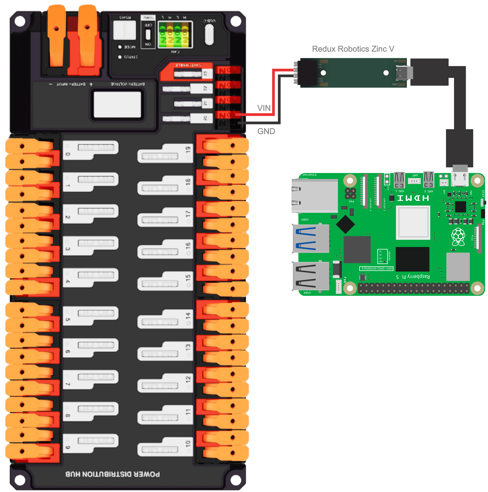
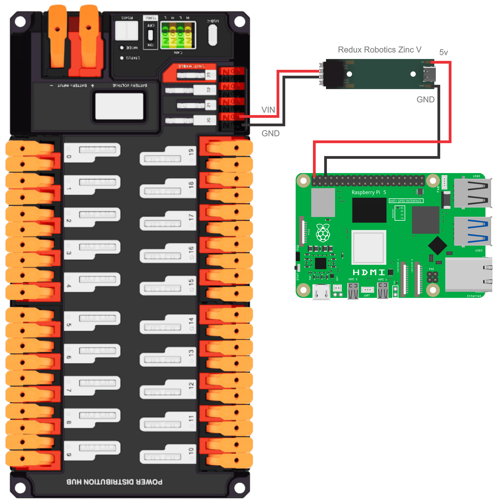

# Wiring


This page is copied directly from [PhotonVision's Wiring Guide](https://docs.photonvision.org/en/v2025.3.2/docs/quick-start/wiring.html), with some text changes


## Coprocessor with regulator

1. **IT IS STRONGLY RECOMMENDED** to use one of the recommended power regulators to prevent vision from cutting out from voltage drops while operating the robot. We recommend wiring the regulator directly to the power header pins or using a locking USB C cable. In any case we recommend hot gluing the connector.
2. Run an ethernet cable from your Pi to your network switch / radio.

This diagram shows how to use the recommended regulator to power a coprocessor.



<figure><figcaption></figcaption></figure>



<figure><figcaption></figcaption></figure>



<figure><figcaption></figcaption></figure>



<figure><figcaption></figcaption></figure>



<figure><figcaption></figcaption></figure>



<figure><figcaption></figcaption></figure>







## Off-Robot Wiring

Plugging your coprocessor into the wall via a power brick or to a computer via a USB C cable will suffice for off robot wiring.


Please make sure your chosen power supply can provide enough power for your coprocessor. Undervolting (where enough power isn’t being supplied) can cause many issues.


