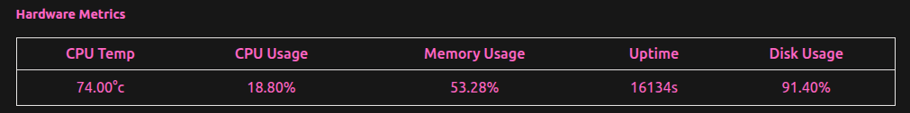

# Settings Page

## Device Status Panel

### Device Info

Shows information about the device, such as the Synapse runtime version, Operating system kind and device IP address

<figure><figcaption></figcaption></figure>

### Hardware Metrics

Shows information about the system's hardware metrics&#x20;


Metrics in the image are not taken from a coprocessor but instead from a laptop with very poor cooling :relaxed:


<figure><figcaption></figcaption></figure>

## Network Settings

* **Team Number:** Will decide what NetworkTable' server to connect to when connected to a robot, this is required to be right and otherwise the robot won't be able to talk to Synapse and vice versa.
* **NetworkTable:** The main table to publish all the data from Synapse into, will also decide the subtable for the `CameraPublisher` Table
* **IP Settings:** Controls the internet address of the device on the network it's connected to
  * **DHCP:** An automatically assigned address by the network manager, may not persist between reboots.
  * **Static IP:** A static address for the device that will persist between reboots.
    * For Synapse, the Static IP option will create a virtual interface that will have the Static IP set on it to retain access to the internet when neeeded in order to be able to `sync` when needed.
* **Hostname:** The name of the device on the local network
* **Network Interface:** Some devices include more than a single network interface, which allows them to be connected to multiple networks at the same time, make sure you set your Static IP on all interfaces in order to be able to deploy to your device on any network.

<figure><figcaption></figcaption></figure>

## Device Control

Allows for downloading and uploading of settings, downloading and viewing logs.

### Danger Zone

Holds dangerous actions such as restarting the device or factory resetting the runtime (Deleting all the settings and persistent values from the device and returning to defaults)

<figure><figcaption></figcaption></figure>

