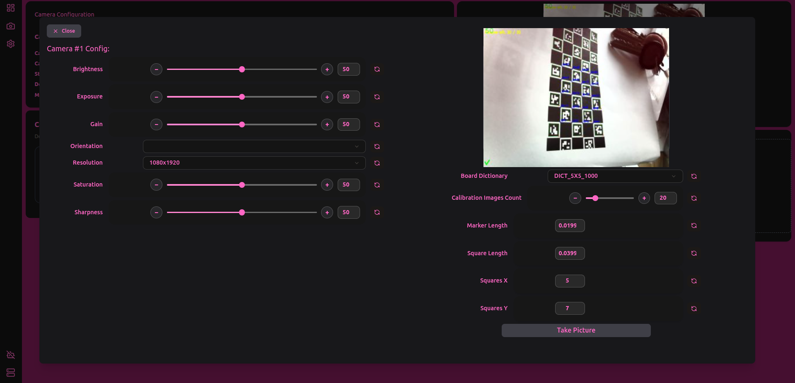

# Camera Page

## Camera Config

Inside of the camera config card, some details will be visible about the current camera, such as:

* Camera Index
* Camera Device Name - system wide device name decided by the OS
  * Some cameras allow modifying this name, which will allow using the same camera model twice.
* Stream Path - The address where the runtime sends and shows the camera stream from
* Default Pipeline - The default pipeline of the camera
* Max FPS - possible max fps for the camera

In the side of the camera dropdown, there is a action button that opens a context menu which allows modifying some of the camera properties, such as the camera's nickname on the runtime.

<figure><figcaption></figcaption></figure>

## Camera Calibration

In order to calibrate your camera, we will use the built in camera calibration by pressing the "Calibrate" Button

This will open a window with all the settings to the camera calibration and help you calibrate the camera within the UI.


For more info on camera calibration, see [camera-calibration.md](../../getting-started/quick-start/camera-calibration.md "mention")


<figure><figcaption></figcaption></figure>
