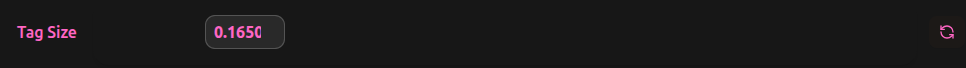

# Settings API

## Data Validation

The Settings API is resposible for managing pipeline & global settings accross all the aspects of the runtime: In-Code, in the UI and in networktables.

Each time a setting is attempted to be modified, the attempted value first goes through the Settings API in order to verify its validity.


Most aspects of the Settings API—such as setting validation and automatic field generation from user-defined setting classes—are abstracted away from the user but can be extended and customized as needed.


## Defining a Settings class

In order for a pipeline to use some setting collection, first we need to define its settings class,

e.g:&#x20;


```python
# ... imports

class MyPipelineSettings(PipelineSettings):
    circle_size = settingField(NumberConstraint(minValue=0, maxValue=None), default=20)
    """Setting for the size of the circle drawn onto the screen"""

    circle_x = settingField(
        NumberConstraint(minValue=0, maxValue=1920), default=1920 / 2
    )
    circle_y = settingField(
        NumberConstraint(minValue=0, maxValue=1080), default=1080 / 2
    )
    """Position of the circle on screen, where (0, 0) is the top-left corner."""

class MyPipeline(Pipeline[MyPipelineSettings]):
    def __init__(self, settings: MyPipelineSettings):
        super().__init__(settings)
```


This class holds 3 settings for our `MyPipeline` pipeline:

* `circle_size`
* `circle_x`
* `circle_y`

Each of these values holds a `Constraint` and its default value, in addition it is also possible to provide a description and a category for the settings that will be visible in the UI.&#x20;


This class will also hold access to the built in pipeline settings (Which are the camera settings):\
Brightness, Exposure, Saturation, Sharpness, Gain, Orientation & Resolution.

These settings will always be rendered in the UI, and will directly affect the camera properties.


## UI Field Generation

The UI recieves information of the registered pipeline types & settings, and with that information is able to know how to render each of the different settings defined in the code, without any additional information.

This allows for automatic setting generation and validation, without any modification to the UI itself in order to support a new pipeline type.

## Constraint Types

There are a few constrainted types built into Synapse:

### Number Constraint

the `NumberConstraint` describes a value that exists inside some _range_ with optional min, max and step values.\
This Constraint will be rendered as a Slider if both min and max values where provided, and a number input field otherwise.

<figure><figcaption></figcaption></figure>

<figure><figcaption></figcaption></figure>

### Boolean Constraint

The `BooleanConstraint` describes a boolean value, and will be rendered as a toggle button, or a button if set to render as one.

<figure><figcaption></figcaption></figure>

### StringConstraint

### EnumeratedConstraint

Describes a list of options to choose from, renders as a dropdown menu.

<figure><figcaption></figcaption></figure>

### ListConstraint

### ColorConstraint

Coming soon...

